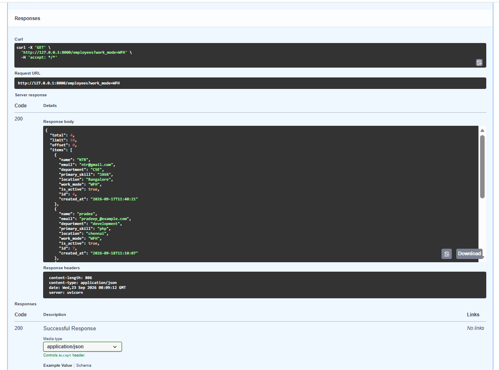
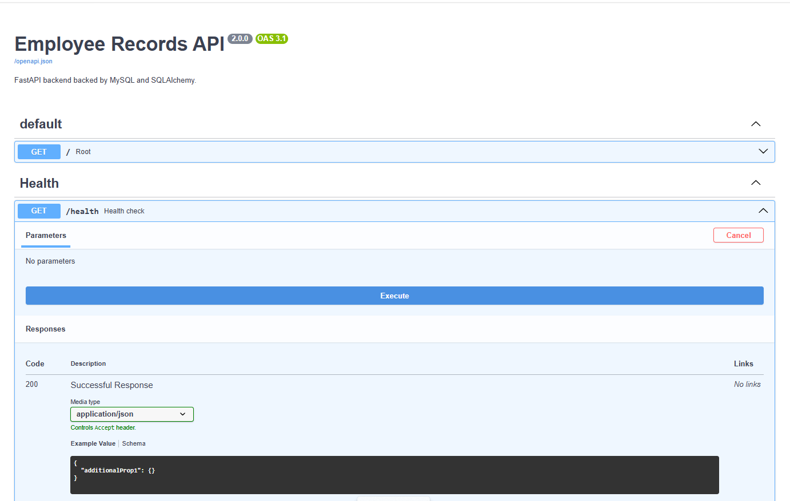
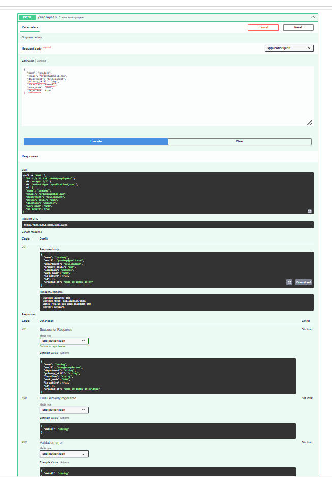
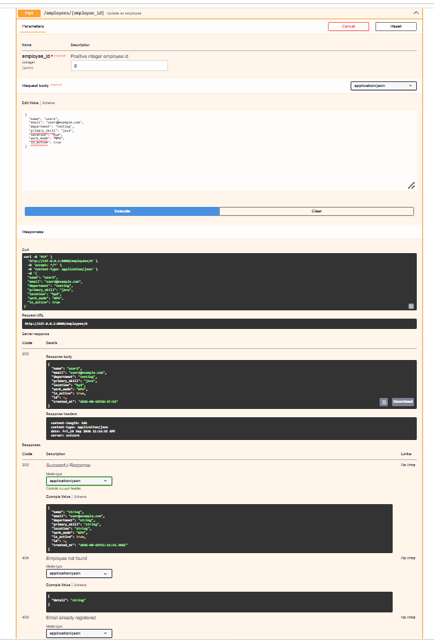
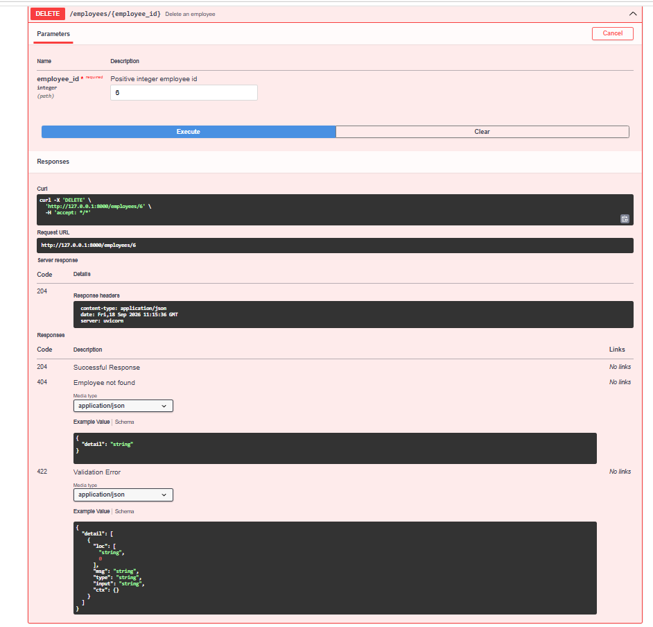
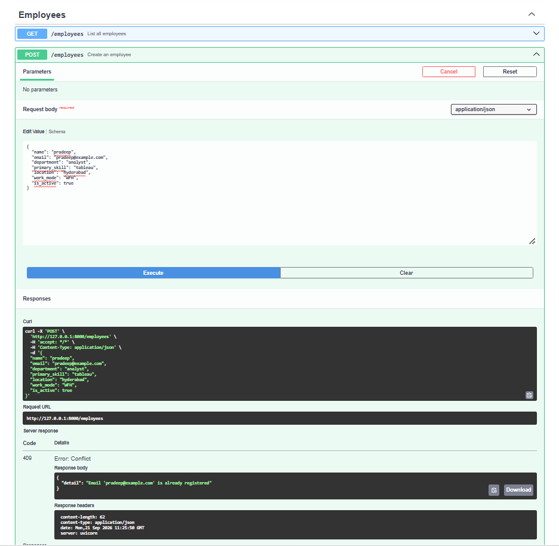
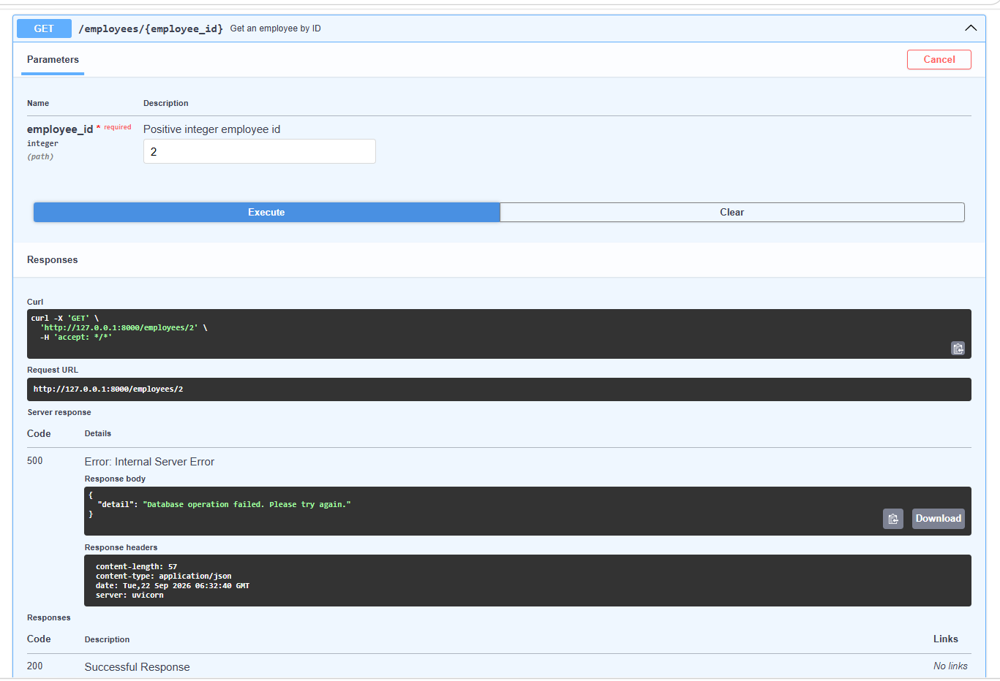

# Employee Records API (Task 3 - Search, Filtering & Pagination)

A FastAPI backend for managing employee records, persisted in a MySQL database using SQLAlchemy ORM. Employee records remain permanently available across restarts, and the API supports advanced filtering, partial-name search, and database-level pagination with envelope responses.

## Tech Stack

- **Python**: 3.12+
- **FastAPI**: Modern, high-performance web framework for building APIs
- **SQLAlchemy**: SQL toolkit and Object-Relational Mapper (ORM)
- **PyMySQL**: Pure-Python MySQL client driver
- **Cryptography**: Authentication backend for MySQL 8.0 `caching_sha2_password`
- **Pydantic v2**: Request validation, response serialization, and email format checking
- **Uvicorn**: Lightning-fast ASGI web server
- **Swagger UI**: Interactive API documentation generated at `/docs`

---

## Project Structure

```text
employee-api/
├── app/
│   ├── __init__.py
│   ├── main.py              # FastAPI app, lifespan setup & route endpoints
│   ├── database.py          # SQLAlchemy engine, session maker & get_db dependency
│   ├── models.py            # SQLAlchemy ORM model for MySQL 'employees' table
│   ├── schemas.py           # Pydantic validation schemas & envelope response models
│   └── services.py          # Database CRUD, search, filter & pagination logic
├── swagger_screenshots/     # Swagger UI API execution screenshots
│   ├── Task_2_screenshots/  # Task 2 CRUD & persistence screenshots
│   └── Task_3_screenshots/  # Task 3 Search, filter & pagination screenshots
│   └── README.md            # Screenshots documentation & previews
├── .env.example             # Environment template with placeholder values
├── .gitignore               # Git ignore file (excludes .env and virtual environments)
├── requirements.txt         # Project dependencies
└── README.md                # Setup, execution & architecture documentation
```

---

## Database Setup & Configuration

### 1. Create MySQL Database
Ensure MySQL Server is running, then open your MySQL client (e.g., MySQL Workbench, Command Line Client) and execute:

```sql
CREATE DATABASE IF NOT EXISTS employee_db;
```

### 2. Configure Environment Variables
Copy the `.env.example` file to `.env`:

```powershell
Copy-Item .env.example .env
```

Open `.env` and configure your MySQL connection details:

```ini
DB_HOST=your_db_host
DB_PORT=your_db_port
DB_USER=your_db_username
DB_PASSWORD=your_db_password
DB_NAME=your_db_name
```

> **Security Note:** The `.env` file is excluded from Git tracking via `.gitignore` to prevent exposing database credentials.

---

## Installation & Execution

### 1. Activate Virtual Environment
```powershell
.\.venv\Scripts\Activate.ps1
```

### 2. Install Dependencies
```powershell
pip install -r requirements.txt
```

### 3. Run the Application
```powershell
python -m uvicorn app.main:app --reload
```
*(Or via uv: `uv run python -m uvicorn app.main:app --reload`)*

On startup, SQLAlchemy automatically creates the `employees` table in your MySQL database via FastAPI's lifespan event.

### 4. Interactive Swagger Documentation
Open your browser and navigate to:
* **Swagger UI:** [http://127.0.0.1:8000/docs](http://127.0.0.1:8000/docs)
* **ReDoc:** [http://127.0.0.1:8000/redoc](http://127.0.0.1:8000/redoc)

---

## API Endpoints

| Method | Endpoint | Description | Status Codes |
| :--- | :--- | :--- | :--- |
| **GET** | `/` | Root application status | `200 OK` |
| **GET** | `/health` | Application liveness check | `200 OK` |
| **POST** | `/employees` | Create a new employee record | `201 Created`, `409 Conflict`, `422 Unprocessable` |
| **GET** | `/employees` | List employees with search, filters & pagination | `200 OK`, `422 Unprocessable` |
| **GET** | `/employees/{id}` | Get employee by integer ID | `200 OK`, `404 Not Found`, `422 Unprocessable` |
| **PUT** | `/employees/{id}` | Update employee record (full replace) | `200 OK`, `404 Not Found`, `409 Conflict`, `422 Unprocessable` |
| **DELETE** | `/employees/{id}` | Delete employee record | `204 No Content`, `404 Not Found`, `422 Unprocessable` |

---

## Task 3: Search, Filtering & Pagination Details

The `GET /employees` endpoint supports optional query parameters to search, filter, and paginate through employee records:

### Query Parameters

| Parameter | Type | Default | Constraints | Description |
| :--- | :--- | :--- | :--- | :--- |
| `search` | string | `None` | Optional | Case-insensitive partial match on employee `name` |
| `department` | string | `None` | Optional | Case-insensitive exact match on `department` |
| `work_mode` | string | `None` | Optional (`WFH`, `WFO`) | Filter by work mode enum |
| `is_active` | boolean | `None` | Optional (`true`, `false`) | Filter by employee active status |
| `limit` | integer | `10` | `1 <= limit <= 100` | Maximum number of records to return per page |
| `offset` | integer | `0` | `offset >= 0` | Number of records to skip |

### Envelope Response Structure (`EmployeeListResponse`)

Instead of returning a flat array, `GET /employees` returns an envelope object containing pagination metadata and items:

```json
{
  "total": 6,
  "limit": 10,
  "offset": 0,
  "items": [
    {
      "id": 2,
      "name": "surya",
      "email": "surya@gmail.com",
      "department": "Engineering",
      "primary_skill": "FastAPI & MySQL",
      "location": "chennai",
      "work_mode": "WFO",
      "is_active": true,
      "created_at": "2026-09-17T06:09:11"
    }
  ]
}
```

* `total`: The total count of records matching the applied filters (before pagination).
* `limit`: The page size used.
* `offset`: The number of skipped records.
* `items`: The list of employee objects for the current page.

---

## Task 3 Screenshots & Verification Evidence

All test scenarios executed and verified in Swagger UI:

### 1. Individual Filter (`work_mode=WFH`)


### 2. Individual Filter 2 (`department=development`)


### 3. Combined Filters (`department=testing` & `work_mode=WFH`)


### 4. Partial-Name Search (`search=dee`)


### 5. Pagination - Page 1 (`limit=2`, `offset=0`)


### 6. Pagination - Page 2 (`limit=2`, `offset=2`)


### 7. No Matching Results (`total: 0`, `items: []`)


---

## Task 2 Screenshots & API Execution Evidence

Visual demonstration of all CRUD API endpoints executed via Swagger UI: 

### 1. Root Endpoint (`GET /`)


### 2. Health Check (`GET /health`)


### 3. Create Employee (`POST /employees`)


### 4. List All Employees (`GET /employees`)


### 5. Get Employee by ID (`GET /employees/{id}`)


### 6. Update Employee (`PUT /employees/{id}`)


### 7. Delete Employee (`DELETE /employees/{id}`)


### 8. Validation Error (`POST /employees` with invalid data)


### 9. Database Error (`500 Internal Server Error` handling)


---

## Data Model & Constraints

### Employee Fields
* `id` (int): Primary key, auto-incremented by MySQL.
* `name` (string): Full name (required, non-empty, non-whitespace).
* `email` (string): Unique email address (case-insensitive check + database-level unique index).
* `department` (string): Department name (required).
* `primary_skill` (string): Core technical or functional skill (required).
* `location` (string): Office or base location (required).
* `work_mode` (string): Enum restricted to `WFH` or `WFO`.
* `is_active` (bool): Defaults to `true` both in schema and database column.
* `created_at` (datetime): UTC timestamp generated at record creation; preserved during updates.

### Validation & Error Handling
* **Whitespace Validation**: Pydantic `@field_validator` rejects empty or whitespace-only inputs.
* **Case-Insensitive Email Uniqueness**: Enforced both via SQLAlchemy query (`func.lower(email)`) and MySQL table constraint.
* **Pagination Constraints**: `limit` is validated to be between 1 and 100 (`ge=1, le=100`), and `offset` must be non-negative (`ge=0`).
* **Database Session Safety**: Sessions are injected using FastAPI's `Depends(get_db)` generator with `try ... finally: db.close()`, guaranteeing sessions are closed after every request.
* **Transaction Rollback**: If a database error occurs, `db.rollback()` is executed immediately to maintain database integrity and prevent session poisoning.

---

## Restart & Persistence Verification

To verify that data persists across application restarts:
1. Start the server: `python -m uvicorn app.main:app --reload`
2. Create an employee via `POST /employees` in Swagger UI (e.g. ID `1`).
3. Terminate the server (`Ctrl + C`).
4. Start the server again: `python -m uvicorn app.main:app --reload`
5. Call `GET /employees/1` in Swagger UI. The record is retrieved from MySQL with the original ID and `created_at` intact.

---

## Notes

### What I Learned
* **Task 2**:
  * Using SQLAlchemy ORM with MySQL to replace in-memory data structures with durable relational storage.
  * Difference between Pydantic schemas (`schemas.py`) and SQLAlchemy ORM models (`models.py`) with `from_attributes = True`.
  * Managing database connection lifecycles via FastAPI dependency injection (`get_db`) to guarantee session closure.
  * Ensuring transaction safety with `db.rollback()`.
* **Task 3**:
  * Building dynamic SQL queries in SQLAlchemy using `query.filter()` conditionally based on provided query parameters.
  * Performing case-insensitive partial searches using `func.lower(EmployeeModel.name).contains(...)`.
  * Executing pagination at the SQL database level using `.offset()` and `.limit()` to ensure high query performance.
  * Designing and implementing envelope response structures (`EmployeeListResponse`) containing both pagination metadata (`total`, `limit`, `offset`) and result items.

### Difficulties Faced
* Handling Windows security restrictions with standalone Python environments and ensuring proper MySQL driver support using `pymysql` and `cryptography`.
* Enforcing case-insensitive email uniqueness consistently across both application logic and database constraints during create and update operations.
* Avoiding route collisions and validation errors when upgrading endpoints from flat lists to paginated envelope response models.

### Assumptions Made
* `PUT /employees/{id}` executes a full replace of all editable fields; `created_at` and `id` remain untouched.
* Email comparison is strictly case-insensitive (`User@Example.com` and `user@example.com` are identical).
* Auto-increment IDs generated by MySQL are never reused after record deletion.
* When no query filters are passed, `GET /employees` defaults to page 1 with `limit=10` and `offset=0`.
