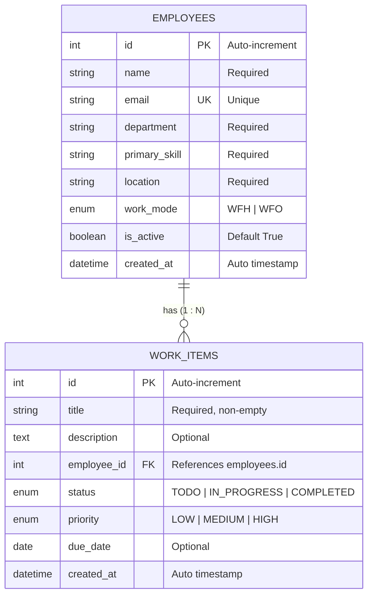
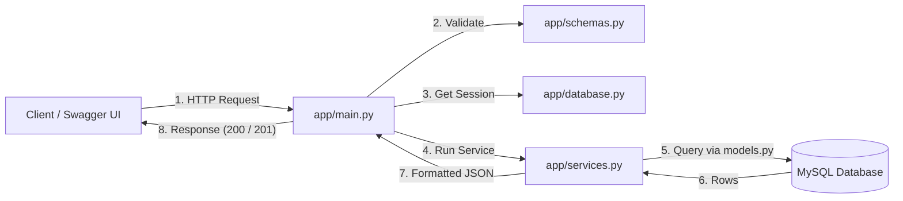

# Employee & Work Item Management API

A production-ready REST API to manage employees and their assigned work items, built using **FastAPI**, **SQLAlchemy**, and **MySQL**. Data is permanently stored in a relational database, persists across server restarts, and demonstrates one-to-many database relationships with referential integrity.

---

## Technologies Used

- **Language:** Python 3.12 / 3.14
- **Framework:** FastAPI
- **Database:** MySQL 8+
- **ORM:** SQLAlchemy 2.0
- **Driver:** PyMySQL & Cryptography
- **Validation:** Pydantic v2
- **Server:** Uvicorn

---

## Project Structure

```text
employee-api/
├── app/
│   ├── __init__.py
│   ├── database.py       # Engine, sessionmaker, Base, and get_db dependency
│   ├── models.py         # SQLAlchemy Employee & WorkItem ORM models with relationships
│   ├── schemas.py        # Pydantic schemas, enums, validators, and response envelopes
│   ├── services.py       # Database CRUD operations, business logic, and queries
│   └── main.py           # FastAPI routes, controllers, and dependency injection
├── swagger_screenshots/  # API verification screenshots
│   ├── Task_2_screenshots/  # Task 2 CRUD & MySQL persistence screenshots
│   ├── Task_3_screenshots/  # Task 3 Employee search, filter & pagination screenshots
│   └── Task_4_screenshots/  # Task 4 Work Item management & relationship test screenshots
├── .env.example          # Environment template
├── .gitignore
├── requirements.txt
└── README.md
```

---

## Project Architecture & File Breakdown

The project follows a **layered separation-of-concerns** architecture where each file handles a distinct responsibility:

### 1. `app/database.py` — Database Engine & Session Management
* **Database Connection:** Constructs a secure MySQL connection string using environment variables with safely encoded passwords via `quote_plus()`.
* **Engine with Health Checks:** Configures SQLAlchemy's `create_engine` with `pool_pre_ping=True` to automatically detect and recover from dropped or idle database connections.
* **Session Lifecycle (`get_db`):** Implements a generator-based dependency (`yield`) that creates a unique `SessionLocal` instance for each incoming HTTP request and guarantees it is cleanly closed in a `finally` block to prevent connection leaks.
* **Declarative Base:** Instantiates `Base = declarative_base()`, which serves as the foundation class for all ORM models.

### 2. `app/models.py` — SQLAlchemy ORM Data Models
* **`Employee` Table (`employees`):**
  * `id`: Auto-incrementing, indexed primary key.
  * `name`, `department`, `primary_skill`, `location`: Required string fields (`nullable=False`).
  * `email`: Indexed unique string (`unique=True`) preventing duplicate email entries at the database level.
  * `work_mode`: Enforced constraint strictly accepting `WFH` or `WFO`.
  * `is_active`: Boolean flag indicating employment status (defaults to `True`).
  * `created_at`: Auto-timestamped using UTC timestamp.
  * **Relationship:** `work_items = relationship("WorkItemModel", back_populates="assigned_employee")`
* **`WorkItem` Table (`work_items`):**
  * `id`: Auto-incrementing, indexed primary key.
  * `title`: Required title (`nullable=False`, string length 255).
  * `description`: Optional text field (`nullable=True`).
  * `employee_id`: Foreign key referencing `employees.id` (`nullable=False`, indexed).
  * `status`: Strictly accepting `TODO`, `IN_PROGRESS`, `COMPLETED` (defaults to `TODO`).
  * `priority`: Strictly accepting `LOW`, `MEDIUM`, `HIGH` (defaults to `MEDIUM`).
  * `due_date`: Optional date field (`nullable=True`).
  * `created_at`: Auto-timestamped using UTC timestamp.
  * **Relationship:** `assigned_employee = relationship("EmployeeModel", back_populates="work_items")`

### 3. `app/schemas.py` — Pydantic Request & Response Schemas
* **Data Transfer Objects (DTOs):** Enforces data validation rules for incoming requests and standardizes outgoing JSON responses.
* **Enums:**
  * `WorkMode`: `"WFH"`, `"WFO"`
  * `WorkItemStatus`: `"TODO"`, `"IN_PROGRESS"`, `"COMPLETED"`
  * `WorkItemPriority`: `"LOW"`, `"MEDIUM"`, `"HIGH"`
* **Input Sanitization & Custom Validators:**
  * `@field_validator` rejects empty or whitespace-only strings for text fields and titles.
* **Employee Schemas:** `EmployeeCreate`, `EmployeeUpdate`, `Employee`, `EmployeeListResponse`.
* **Work Item Schemas:**
  * `EmployeeSummary`: Lightweight DTO (`id`, `name`, `email`) included inside every work item response.
  * `WorkItemCreate`: Validates payload for creating and assigning a work item (`POST /work-items`).
  * `WorkItemUpdate`: Validates payload for updating details or reassigning a work item (`PUT /work-items/{id}`).
  * `WorkItem`: Serializes a single work item with nested `assigned_employee` via `from_attributes=True`.
  * `WorkItemListResponse`: Wraps work item lists into an envelope with metadata (`total`, `limit`, `offset`, `items`).

### 4. `app/services.py` — Business Logic & Database Queries
* **Decoupled Business Logic:** Encapsulates all database queries and transactions, keeping route handlers lean and focused solely on HTTP handling.
* **Employee Management (`EmployeeService`):** Duplicate email checks, paginated queries, find by ID, update, and safe deletion.
* **Work Item Management (`WorkItemService`):**
  * `create_work_item`: Validates assignee exists before creating a work item.
  * `list_work_items`: Executes dynamic SQL filtering (title search, employee, status, priority), pre-pagination count, ascending ordering by ID, and SQL-level limit/offset.
  * `get_work_item`: Retrieves a single work item by ID.
  * `update_work_item`: Validates work item and new assignee existence before updating fields.
  * `delete_work_item`: Deletes work item record safely with transaction rollback.

### 5. `app/main.py` — FastAPI Routing & Controllers
* **Application Entry Point:** Configures the FastAPI app instance, metadata, and auto-generates interactive Swagger UI docs at `/docs`.
* **Automatic Table Creation:** Calls `Base.metadata.create_all(bind=engine)` in lifespan to ensure database schemas exist.
* **Endpoint Routing:** RESTful endpoints for health check, employee CRUD, and work item CRUD.
* **Input Constraints:** Enforces path constraints (`gt=0`) and query parameters (`limit: 1–100`, `offset >= 0`, `employee_id > 0`).

---

## Database Relationship Explanation


```mermaid
erDiagram
    EMPLOYEES ||--o{ WORK_ITEMS : "has (1 : N)"
    EMPLOYEES {
        int id PK "Auto-increment"
        string name "Required"
        string email UK "Unique"
        string department "Required"
        string primary_skill "Required"
        string location "Required"
        enum work_mode "WFH | WFO"
        boolean is_active "Default True"
        datetime created_at "Auto timestamp"
    }
    WORK_ITEMS {
        int id PK "Auto-increment"
        string title "Required, non-empty"
        text description "Optional"
        int employee_id FK "References employees.id"
        enum status "TODO | IN_PROGRESS | COMPLETED"
        enum priority "LOW | MEDIUM | HIGH"
        date due_date "Optional"
        datetime created_at "Auto timestamp"
    }
```

### 1. One-to-Many (`1 : N`) Connection
* One employee can be assigned multiple work items (`0, 1, or many`).
* Each work item belongs to exactly one employee via `employee_id`.

### 2. Foreign Key & SQLAlchemy Relationship
* **Database Constraint:** `work_items.employee_id` defines `ForeignKey("employees.id")`, enforcing relational integrity at the MySQL database engine level.
* **SQLAlchemy Bidirectional Mapping:**
  * On `WorkItemModel`: `assigned_employee = relationship("EmployeeModel", back_populates="work_items")`
  * On `EmployeeModel`: `work_items = relationship("WorkItemModel", back_populates="assigned_employee")`
* **Seamless Pydantic Serialization:** Because the relationship attribute on `WorkItemModel` is named `assigned_employee`, Pydantic's `WorkItem` schema automatically resolves and nests the employee's `id`, `name`, and `email` without manual object transformation.

---

## Application Request Flow


```mermaid
flowchart LR
    A["Client / Swagger UI"] -->|"1. HTTP Request"| B["app/main.py"]
    B -->|"2. Validate"| C["app/schemas.py"]
    B -->|"3. Get Session"| D["app/database.py"]
    B -->|"4. Run Service"| E["app/services.py"]
    E -->|"5. Query via models.py"| F[("MySQL Database")]
    F -->|"6. Rows"| E
    E -->|"7. Formatted JSON"| B
    B -->|"8. Response (200 / 201)"| A
```

---

## Database Setup & Configuration

### 1. Create MySQL Database
Log in to MySQL:
```bash
mysql -u root -p
```
Run this command:
```sql
CREATE DATABASE IF NOT EXISTS employee_db;
EXIT;
```

### 2. Configure `.env`
Create a `.env` file in the project root:
```env
DB_HOST=localhost
DB_PORT=3306
DB_USER=root
DB_PASSWORD=YOUR_MYSQL_PASSWORD
DB_NAME=employee_db
```

---

## How to Run

1. **Activate Virtual Environment:**
   ```powershell
   .\.venv\Scripts\Activate.ps1
   ```
2. **Install Dependencies:**
   ```bash
   pip install -r requirements.txt
   ```
3. **Start the Server:**
   ```bash
   python -m uvicorn app.main:app --reload --port 8000
   ```
4. **Open Swagger Documentation:**
   Go to [http://127.0.0.1:8000/docs](http://127.0.0.1:8000/docs) to test the endpoints interactively.

---

## API Endpoints Summary

| Method | Endpoint | Description | Status Codes |
|---|---|---|---|
| `GET` | `/` | Welcome message | `200` |
| `GET` | `/health` | Application liveness check | `200` |
| `POST` | `/employees` | Add new employee | `201`, `409`, `422` |
| `GET` | `/employees` | List employees (with search, filters & pagination) | `200`, `422` |
| `GET` | `/employees/{id}` | Get employee by ID | `200`, `404`, `422` |
| `PUT` | `/employees/{id}` | Update employee details | `200`, `404`, `409`, `422` |
| `DELETE` | `/employees/{id}` | Delete employee | `200`, `404`, `422` |
| `POST` | `/work-items` | Create and assign a work item to an employee | `201`, `404`, `422` |
| `GET` | `/work-items` | List work items (with search, filters & pagination) | `200`, `422` |
| `GET` | `/work-items/{work_item_id}` | Get single work item by ID | `200`, `404`, `422` |
| `PUT` | `/work-items/{work_item_id}` | Update work item details or reassign employee | `200`, `404`, `422` |
| `DELETE` | `/work-items/{work_item_id}` | Delete work item | `204`, `404`, `422` |

---

## Work Item API Details & Sample Requests

### 1. Create and Assign Work Item (`POST /work-items`)
* **Status:** `201 Created`
* **Validation:** Assignee employee must exist in the database (otherwise `404`). Title must not be blank or whitespace.

#### Sample Request Body:
```json
{
  "title": "Prepare weekly status report",
  "description": "Consolidate sprint progress and blockers for leadership sync",
  "employee_id": 2,
  "status": "TODO",
  "priority": "MEDIUM",
  "due_date": "2026-10-15"
}
```

#### Sample Response (`201 Created`):
```json
{
  "id": 1,
  "title": "Prepare weekly status report",
  "description": "Consolidate sprint progress and blockers for leadership sync",
  "employee_id": 2,
  "status": "TODO",
  "priority": "MEDIUM",
  "due_date": "2026-10-15",
  "created_at": "2026-10-06T15:45:00",
  "assigned_employee": {
    "id": 2,
    "name": "ravi",
    "email": "ravi@gmail.com"
  }
}
```

---

### 2. List Work Items with Filtering, Search & Pagination (`GET /work-items`)
* **Status:** `200 OK`
* **Supported Query Parameters:**
  * `search` *(string, optional)*: Partial and case-insensitive search strictly on the `title`.
  * `employee_id` *(integer, optional, `gt=0`)*: Filter by assigned employee ID.
  * `status` *(enum, optional)*: Filter by status (`TODO`, `IN_PROGRESS`, `COMPLETED`).
  * `priority` *(enum, optional)*: Filter by priority (`LOW`, `MEDIUM`, `HIGH`).
  * `limit` *(integer, default `10`, range `1–100`)*: Maximum records to return.
  * `offset` *(integer, default `0`, min `0`)*: Number of records to skip.
* **SQL Optimization:** All filtering, pre-pagination counting (`query.count()`), deterministic ascending ordering (`order_by(WorkItemModel.id.asc())`), and pagination (`offset()`, `limit()`) run directly on the database engine.

#### Sample Request:
```http
GET /work-items?status=TODO&priority=MEDIUM&limit=10&offset=0
```

#### Sample Response (`200 OK`):
```json
{
  "total": 2,
  "limit": 10,
  "offset": 0,
  "items": [
    {
      "id": 1,
      "title": "Prepare weekly status report",
      "description": "Consolidate sprint progress and blockers for leadership sync",
      "employee_id": 2,
      "status": "TODO",
      "priority": "MEDIUM",
      "due_date": "2026-10-15",
      "created_at": "2026-10-06T15:45:00",
      "assigned_employee": {
        "id": 2,
        "name": "ravi",
        "email": "ravi@gmail.com"
      }
    }
  ]
}
```

---

### 3. Get Work Item by ID (`GET /work-items/{work_item_id}`)
* **Status:** `200 OK`
* **Error:** `404 Not Found` if the work item ID does not exist.

#### Sample Request:
```http
GET /work-items/1
```

#### Sample Response (`200 OK`):
```json
{
  "id": 1,
  "title": "Prepare weekly status report",
  "description": "Consolidate sprint progress and blockers for leadership sync",
  "employee_id": 2,
  "status": "TODO",
  "priority": "MEDIUM",
  "due_date": "2026-10-15",
  "created_at": "2026-10-06T15:45:00",
  "assigned_employee": {
    "id": 2,
    "name": "ravi",
    "email": "ravi@gmail.com"
  }
}
```

---

### 4. Update Work Item or Reassign (`PUT /work-items/{work_item_id}`)
* **Status:** `200 OK`
* **Validation:** Work item must exist (otherwise `404`). If reassigning to another `employee_id`, target employee must exist (otherwise `404`).

#### Sample Request Body:
```json
{
  "title": "Finalize weekly status report",
  "description": "Review sprint metrics and distribute report",
  "employee_id": 3,
  "status": "IN_PROGRESS",
  "priority": "HIGH",
  "due_date": "2026-10-18"
}
```

#### Sample Response (`200 OK`):
```json
{
  "id": 1,
  "title": "Finalize weekly status report",
  "description": "Review sprint metrics and distribute report",
  "employee_id": 3,
  "status": "IN_PROGRESS",
  "priority": "HIGH",
  "due_date": "2026-10-18",
  "created_at": "2026-10-06T15:45:00",
  "assigned_employee": {
    "id": 3,
    "name": "karthi",
    "email": "karthi@gmail.com"
  }
}
```

---

### 5. Delete Work Item (`DELETE /work-items/{work_item_id}`)
* **Status:** `204 No Content`
* **Error:** `404 Not Found` if the work item ID does not exist.

#### Sample Request:
```http
DELETE /work-items/1
```

---

## Validation & Error Handling

| Scenario | HTTP Status | Error Message / Behavior |
|---|---|---|
| **Non-existent Work Item** | `404 Not Found` | `{"detail": "Work item with id {id} not found"}` |
| **Non-existent Employee (Assign / Reassign)** | `404 Not Found` | `{"detail": "Employee with id {employee_id} not found"}` |
| **Blank or Whitespace-only Title** | `422 Unprocessable Content` | `{"detail": "title: Title cannot be empty or contain only whitespace."}` |
| **Invalid Status or Priority Value** | `422 Unprocessable Content` | `{"detail": "status: Input should be 'TODO', 'IN_PROGRESS' or 'COMPLETED'"}` |
| **Negative or Zero IDs (`id <= 0`)** | `422 Unprocessable Content` | Enforced by FastAPI's `Path(..., gt=0)` and Pydantic's `Field(..., gt=0)` |
| **Pagination Out of Range (`limit > 100`, `limit < 1`, `offset < 0`)** | `422 Unprocessable Content` | Enforced by FastAPI's `Query(ge=1, le=100)` and `Query(ge=0)` |
| **Database Failure / Downtime** | `500 Internal Server Error` | Graceful rollback via `db.rollback()` to keep sessions clean |

---

## Assumptions Made

1. **Foreign Key Integrity:** A work item must always be assigned to an existing employee (`employee_id` required).
2. **Default Values:** `status` defaults to `TODO` and `priority` defaults to `MEDIUM` if omitted during creation.
3. **Ascending Order:** Work items are sorted deterministically in ascending order by primary key ID (`WorkItemModel.id.asc()`).
4. **Pre-Pagination Total:** The `total` field in `GET /work-items` reflects the total number of matching records before `limit` and `offset` are evaluated.
5. **Partial Title Search:** The `search` query parameter evaluates against `WorkItemModel.title` using case-insensitive SQL matching (`func.lower()` and `LIKE %...%`).
6. **No Orphaned Records:** Deleting a work item deletes only the task; the employee remains untouched.

---

## Difficulties Faced & Solutions

### 1. Database Setup, Engine & Connection Issues
* **FastAPI Database Session Dependency Error:**  
  * *Difficulty:* Initially using `db: Session = get_db()` caused FastAPI to treat the database generator as a regular parameter instead of resolving it.
  * *Solution:* Injected the session using FastAPI's dependency system: `db: Session = Depends(get_db)`.
* **MySQL 8+ Authentication (`caching_sha2_password`):**  
  * *Difficulty:* Connecting PyMySQL to MySQL 8+ resulted in `Authentication plugin 'caching_sha2_password' is not supported` errors.
  * *Solution:* Installed the `cryptography` Python package to support modern secure MySQL authentication.
* **Special Characters in Database Credentials:**  
  * *Difficulty:* Passwords containing special characters (like `@`, `#`) broke connection strings.
  * *Solution:* Safely encoded passwords using `urllib.parse.quote_plus()`.
* **Leaking `.env` in Git Tracking:**  
  * *Difficulty:* `.gitignore` initially had `.env/` which left the `.env` configuration file untracked and vulnerable.
  * *Solution:* Corrected the rule to `.env` to properly ignore the file.

### 2. Schema Validation, CRUD & Data Integrity
* **Swagger UI Missing PUT Edit Fields:**  
  * *Difficulty:* In `PUT /employees/{id}`, request body fields were not showing up properly.
  * *Solution:* Inherited `EmployeeUpdate` from `EmployeeBase` so that all modifiable fields were included.
* **Case-Insensitive Email Duplicate Checks:**  
  * *Difficulty:* Standard string comparisons allowed duplicate emails with different casing (`user@example.com` vs `USER@EXAMPLE.COM`).
  * *Solution:* Used SQL's `func.lower(EmployeeModel.email) == email.strip().lower()` for case-insensitive duplicate checks.
* **JSON Boolean Syntax Error in Request Payloads (RFC 8259):**  
  * *Difficulty:* Sending Python-style booleans (`"is_active": False`) produced HTTP `422 JSON decode error`.
  * *Solution:* Ensured all client requests follow the JSON specification by strictly using lowercase booleans (`true` / `false`).
* **Preserving Immutable Fields on Updates:**  
  * *Difficulty:* Updating an employee risked overwriting their original `created_at` timestamp.
  * *Solution:* Explicitly updated only the mutable fields and left `created_at` intact.

### 3. Search, Filtering & Pagination Logic
* **Response Validation Mismatch on Pagination:**  
  * *Difficulty:* When changing `GET /employees` from a plain list to a pagination object (`{ total, limit, offset, items }`), FastAPI threw an HTTP `500 ResponseValidationError`.
  * *Solution:* Updated the route's `response_model` to the envelope schema `EmployeeListResponse`.
* **Pre-Pagination Count Calculation:**  
  * *Difficulty:* Calling `.count()` after applying `.limit()` and `.offset()` only counted the items on the current page.
  * *Solution:* Executed `total = query.count()` *before* chaining `.offset()` and `.limit()`.
* **Query Parameter Boundary Validation:**  
  * *Difficulty:* Negative offsets or limits greater than 100 could cause performance degradation.
  * *Solution:* Enforced boundaries using FastAPI's `Query(ge=1, le=100)` for limit and `Query(ge=0)` for offset.

### 4. Relational Database & Work Item Management
* **Model Attribute Synchronization (`due_date` & `description`):**  
  * *Difficulty:* Instantiating `WorkItemModel(due_date=...)` produced `TypeError: 'due_date' is an invalid keyword argument for WorkItemModel` because columns were omitted from the SQLAlchemy model class.
  * *Solution:* Added `description = Column(Text, nullable=True)` and `due_date = Column(Date, nullable=True)` to `WorkItemModel`.
* **Nested Pydantic Serialization for Relationships:**  
  * *Difficulty:* Embedding employee info (`id`, `name`, `email`) inside work items normally requires manual joins and mapping.
  * *Solution:* Named the SQLAlchemy relationship `assigned_employee` on `WorkItemModel` to match the Pydantic field name and enabled `from_attributes=True`, allowing FastAPI to automatically serialize the nested employee details.
* **REST URL Path Naming Inconsistency:**  
  * *Difficulty:* Initial endpoints used underscores (`/work_items`), which conflicted with RESTful conventions and the project specification (`/work-items`).
  * *Solution:* Standardized all routes to use hyphens (`POST /work-items`, `GET /work-items/{id}`, etc.).
* **Reassignment Validation:**  
  * *Difficulty:* Reassigning a work item to an employee who does not exist could cause orphaned or corrupt task allocations.
  * *Solution:* Added pre-checks verifying that the target employee exists (returning `404`) before updating.
