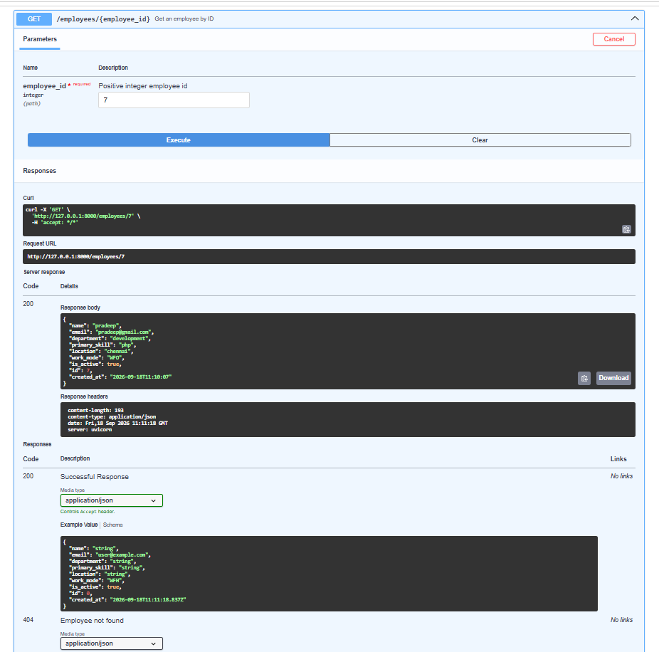

# Task 2 Screenshots & API Verification

This directory contains visual execution evidence for all endpoints in the Employee Records API (**Task 2 - MySQL & SQLAlchemy Integration**).

---

## 📸 Photo Paths & Endpoints

| Endpoint | Method | Status | Photo Path |
| :--- | :--- | :--- | :--- |
| **Root Endpoint** | `GET /` | `200 OK` | [`Task_2_screenshots/Get root.png`](Get%20root.png) |
| **Health Check** | `GET /health` | `200 OK` | [`Task_2_screenshots/Health.png`](Health.png) |
| **Create Employee** | `POST /employees` | `201 Created` | [`Task_2_screenshots/create_Employees.png`](create_Employees.png) |
| **List All Employees** | `GET /employees` | `200 OK` | [`Task_2_screenshots/List all Employees.png`](List%20all%20Employees.png) |
| **Get Employee by ID** | `GET /employees/{id}` | `200 OK` | [`Task_2_screenshots/Employees_ID.png`](Employees_ID.png) |
| **Update Employee** | `PUT /employees/{id}` | `200 OK` | [`Task_2_screenshots/Update_all_Employees.png`](Update_all_Employees.png) |
| **Delete Employee** | `DELETE /employees/{id}` | `204 No Content` | [`Task_2_screenshots/Delete_Employee_Details.png`](Delete_Employee_Details.png) |

---

## 🖼️ Connected Visual Evidence

### 1. Root Endpoint (`GET /`)
* **Photo Path:** `Task_2_screenshots/Get root.png`
* **Description:** Verifies application is running and responding to the root endpoint.

---

### 2. Health Check (`GET /health`)
* **Photo Path:** `Task_2_screenshots/Health.png`
* **Description:** Liveness check endpoint returning `{"status": "ok"}`.

---

### 3. Create Employee (`POST /employees`)
* **Photo Path:** `Task_2_screenshots/create_Employees.png`
* **Description:** Creates an employee record in MySQL via SQLAlchemy and returns `201 Created` with generated ID and timestamp.

---

### 4. List All Employees (`GET /employees`)
* **Photo Path:** `Task_2_screenshots/List all Employees.png`
* **Description:** Retrieves all employee records stored in the MySQL database.

---

### 5. Get Employee by ID (`GET /employees/{id}`)
* **Photo Path:** `Task_2_screenshots/Employees_ID.png`
* **Description:** Fetches a single employee record by integer ID (`200 OK`).

---

### 6. Update Employee (`PUT /employees/{id}`)
* **Photo Path:** `Task_2_screenshots/Update_all_Employees.png`
* **Description:** Performs full update of employee details while preserving the original `created_at` timestamp.

---

### 7. Delete Employee (`DELETE /employees/{id}`)
* **Photo Path:** `Task_2_screenshots/Delete_Employee_Details.png`
* **Description:** Removes an employee from MySQL and returns `204 No Content`.

