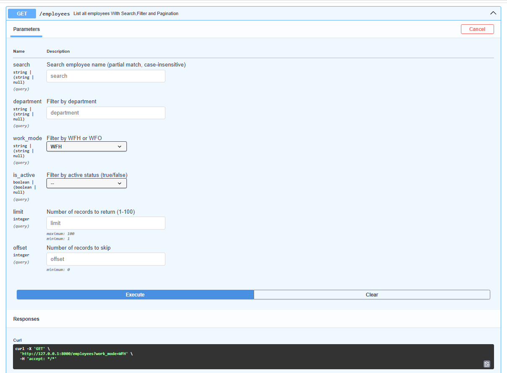
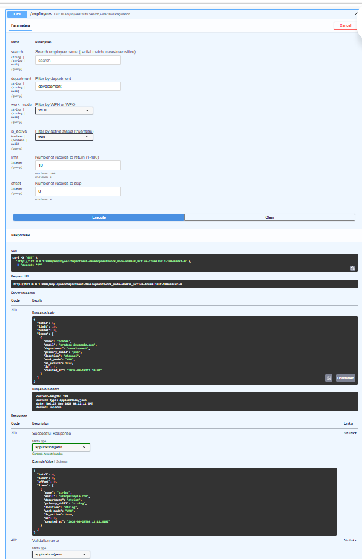
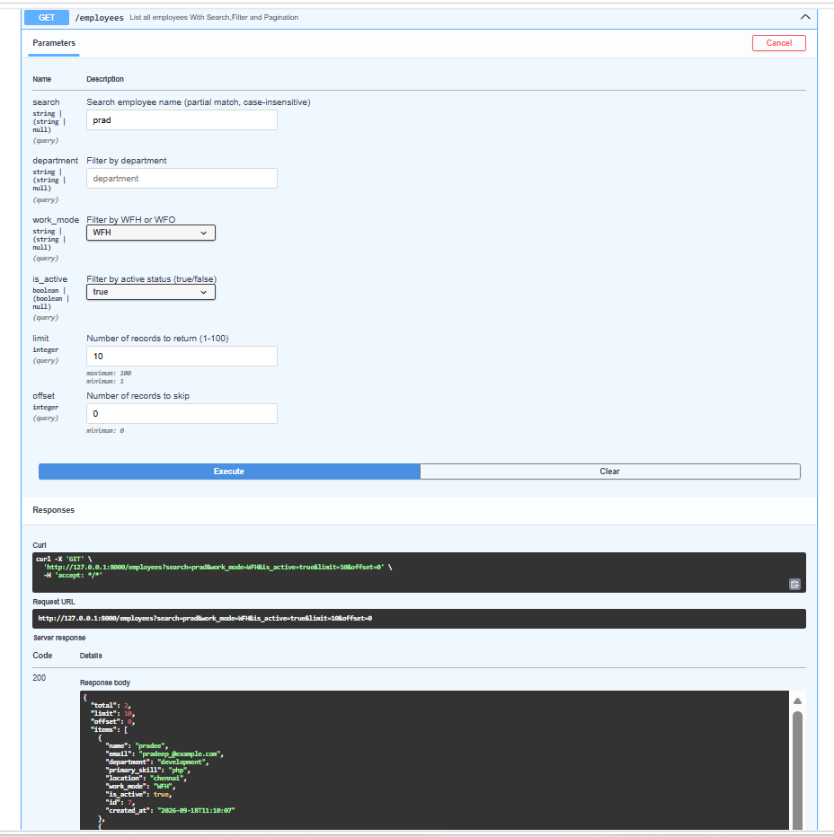
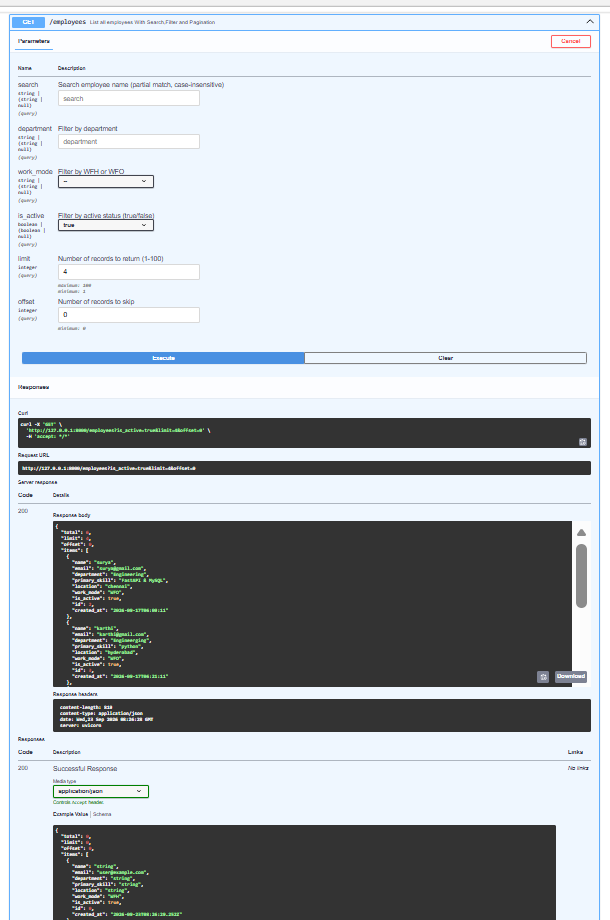
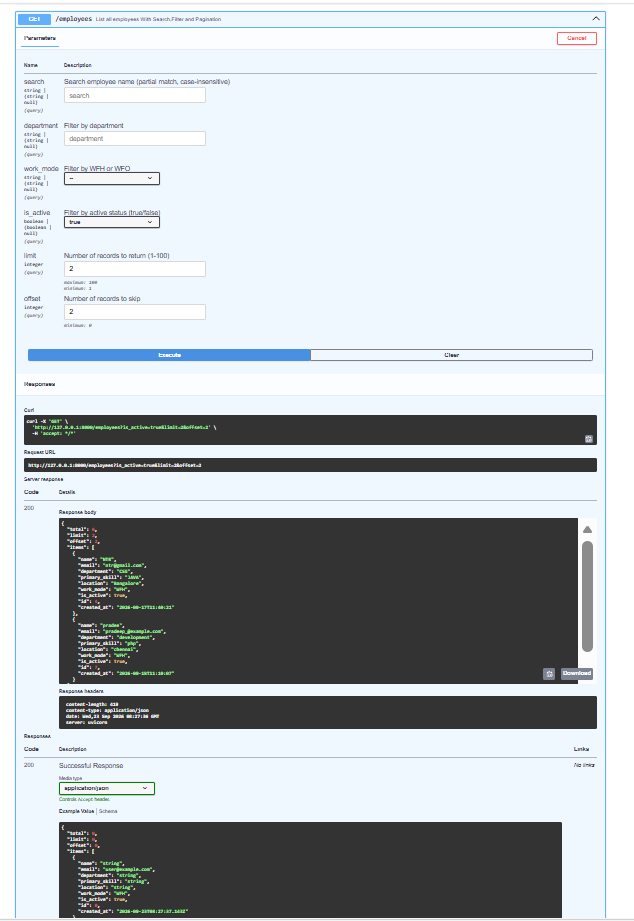
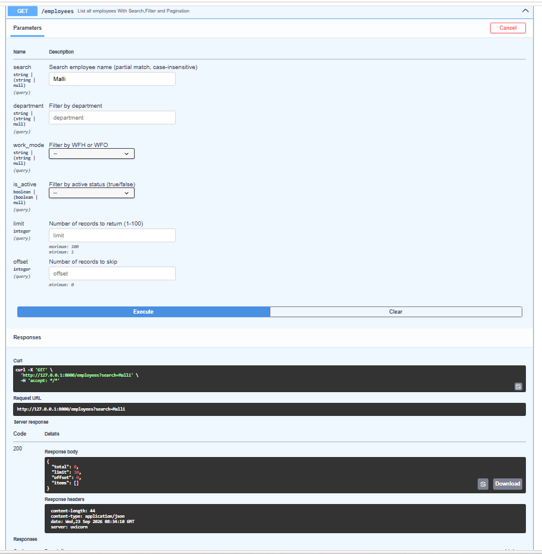

# Swagger UI Screenshots

This directory contains the Swagger UI interactive documentation screenshots for the Employee Records API, covering Task 2 (CRUD Operations & Persistence) and Task 3 (Search, Filtering & Pagination).

---

## 📸 Screenshots Directory Structure

```text
swagger_screenshots/
├── Task_2_screenshots/        # Task 2 CRUD operations, errors & persistence
│   ├── Get root.png
│   ├── Health.png
│   ├── create_Employees.png
│   ├── List all Employees.png
│   ├── Employees_ID.png
│   ├── Update_all_Employees.png
│   ├── Delete_Employee_Details.png
│   ├── validation_error.png
│   └── Database_error.png
└── Task_3_screenshots/        # Task 3 Search, filters & pagination
    ├── Individual_Filter.png
    ├── Individual_Filter_2.png
    ├── Combined_Filters.png
    ├── Partial_Name_Filter.png
    ├── Pagination_Page_1.png
    ├── Pagination_Page_2.png
    └── No_Matching_Results.png
```

---

## 🎯 Task 3: Search, Filter & Pagination Evidence

| Test Scenario | Parameters Used | Screenshot |
| :--- | :--- | :--- |
| **Individual Filter (Work Mode)** | `work_mode=WFH` | [`Individual_Filter.png`](Task_3_screenshots/Individual_Filter.png) |
| **Individual Filter 2 (Department)** | `department=development` | [`Individual_Filter_2.png`](Task_3_screenshots/Individual_Filter_2.png) |
| **Combined Filters** | `department=testing` & `work_mode=WFH` | [`Combined_Filters.png`](Task_3_screenshots/Combined_Filters.png) |
| **Partial-Name Search** | `search=dee` (matches "pradee" & "pradeep") | [`Partial_Name_Filter.png`](Task_3_screenshots/Partial_Name_Filter.png) |
| **Pagination (Page 1)** | `limit=2`, `offset=0` | [`Pagination_Page_1.png`](Task_3_screenshots/Pagination_Page_1.png) |
| **Pagination (Page 2)** | `limit=2`, `offset=2` | [`Pagination_Page_2.png`](Task_3_screenshots/Pagination_Page_2.png) |
| **No Matching Results** | `search=NonExistent` (returns `total: 0`, `items: []`) | [`No_Matching_Results.png`](Task_3_screenshots/No_Matching_Results.png) |

---

## 🖼️ Task 3 Visual Previews

### 1. Individual Filter (`work_mode=WFH`)


### 2. Combined Filters (`department=testing` & `work_mode=WFH`)


### 3. Partial-Name Search (`search=dee`)


### 4. Pagination - Page 1 (`limit=2`, `offset=0`)


### 5. Pagination - Page 2 (`limit=2`, `offset=2`)


### 6. No Matching Results (`total: 0`, `items: []`)


---

## 📋 Task 2: CRUD & Persistence Evidence

| Action | Endpoint | Image File |
| :--- | :--- | :--- |
| **Root Endpoint** | `GET /` | [`Get root.png`](Task_2_screenshots/Get%20root.png) |
| **Health Check** | `GET /health` | [`Health.png`](Task_2_screenshots/Health.png) |
| **Create Employee** | `POST /employees` | [`create_Employees.png`](Task_2_screenshots/create_Employees.png) |
| **List All Employees** | `GET /employees` | [`List all Employees.png`](Task_2_screenshots/List%20all%20Employees.png) |
| **Get Employee by ID** | `GET /employees/{id}` | [`Employees_ID.png`](Task_2_screenshots/Employees_ID.png) |
| **Update Employee** | `PUT /employees/{id}` | [`Update_all_Employees.png`](Task_2_screenshots/Update_all_Employees.png) |
| **Delete Employee** | `DELETE /employees/{id}` | [`Delete_Employee_Details.png`](Task_2_screenshots/Delete_Employee_Details.png) |
| **Validation Error** | `POST /employees` (Invalid Email) | [`validation_error.png`](Task_2_screenshots/validation_error.png) |
| **Database Error** | Duplicate / DB Error | [`Database_error.png`](Task_2_screenshots/Database_error.png) |
