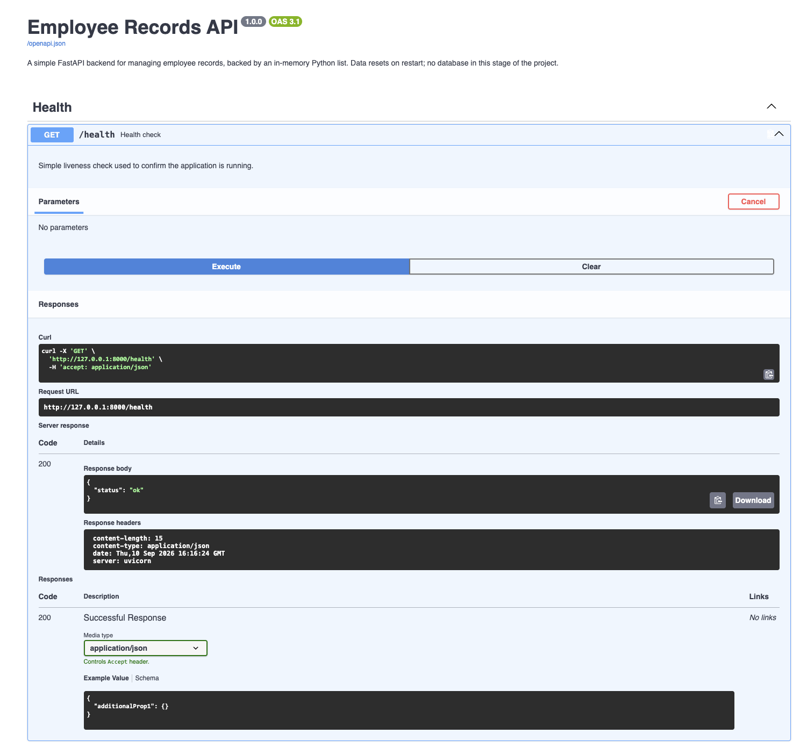
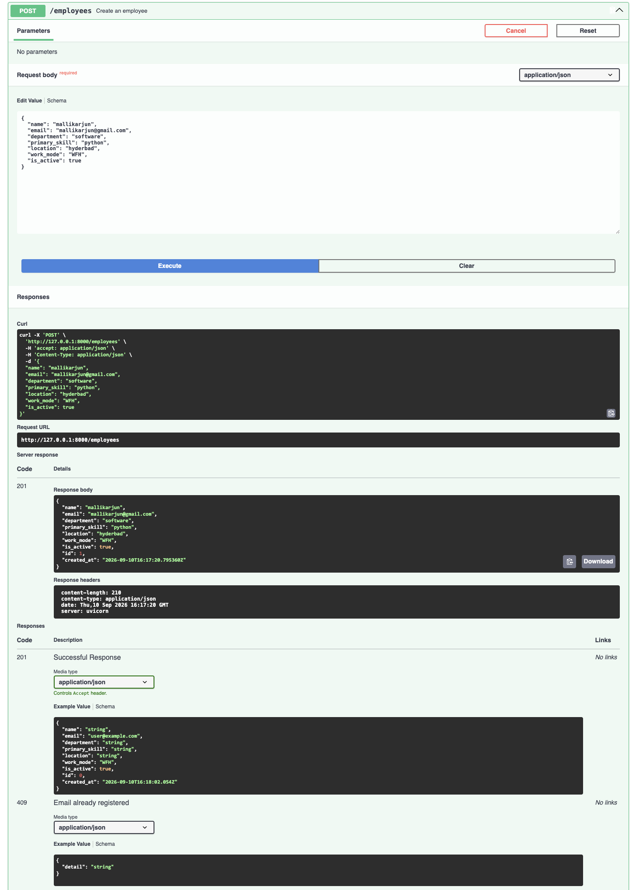
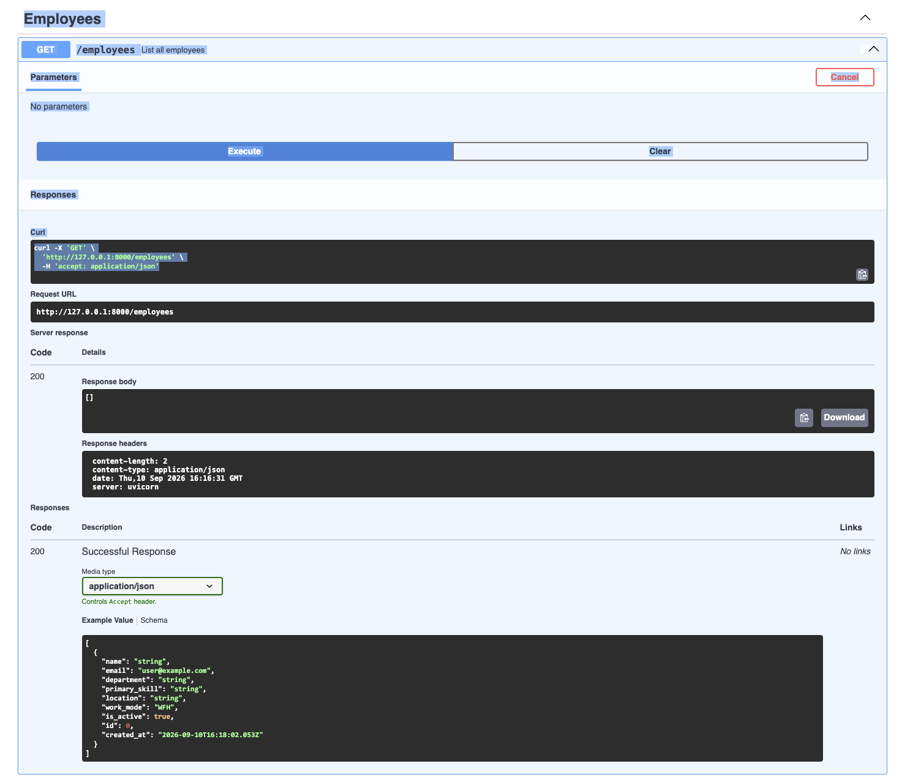
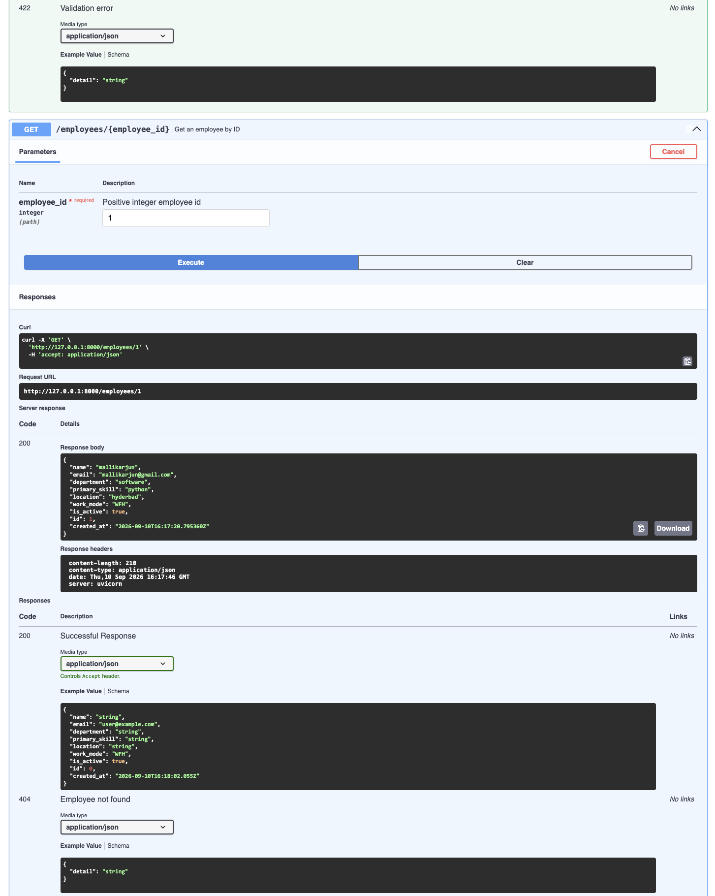
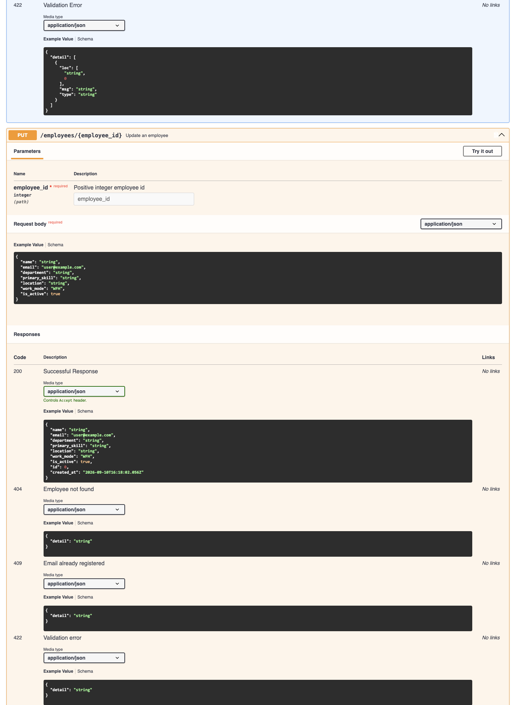
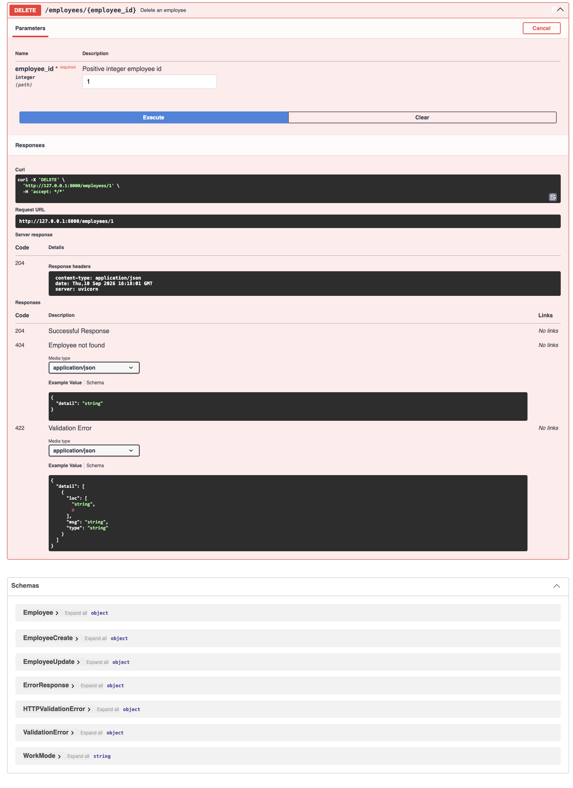

# Swagger UI Screenshots

This directory contains the Swagger UI interactive documentation screenshots for the Employee Records API.

---

## 📸 Screenshots Overview

| Action | Endpoint | Image File |
| :--- | :--- | :--- |
| **Health Check** | `GET /health` | [`Health.png`](Health.png) |
| **Create Employee** | `POST /employees` | [`create_employees.png`](create_employees.png) |
| **List All Employees** | `GET /employees` | [`employees_list.png`](employees_list.png) |
| **Get Employee by ID** | `GET /employees/{id}` | [`employee_id.png`](employee_id.png) |
| **Update Employee** | `PUT /employees/{id}` | [`employees_update.png`](employees_update.png) |
| **Delete Employee** | `DELETE /employees/{id}` | [`employees_delete.png`](employees_delete.png) |

---

## 🖼️ Visual Previews

### 1. Health Check (`GET /health`)

---

### 2. Create Employee (`POST /employees`)

---

### 3. List All Employees (`GET /employees`)

---

### 4. Get Employee by ID (`GET /employees/{id}`)

---

### 5. Update Employee (`PUT /employees/{id}`)

---

### 6. Delete Employee (`DELETE /employees/{id}`)

